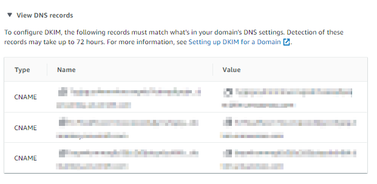

# DAY 1 - AMAZON SES

<h2 align="center">

  

</h2>

## What is Amazon SES ?
Amazon Simple Email Service (SES) is a cloud-based email service that provides cost-effective, flexible and scalable way for businesses of all sizes to keep in contact with their customers through email. In  ither words **Highly-scalable inbound and outbound email service**.

### What is the use cases ?

**SMTP Services**
Amazon SES sends email using SMTP, which is the most common email protocol on the internet. 
You can also send emails by using  diffrent  SMTP enabled programming languages and software.

example : -
#### How to Configure WordPress to Use SMTP For Sending Emails ?
its easy now with AMAZON SES, you setup it with SMTP user name and password &  SMTP credentials which i will show you below.

## Prerequisite
- AWS Account with Access to AMAZON SES ( Administrative privilages)
  
## Setup SES for your Application

###  Request for production access
First things first, as AWS will give you initially a sandbox environment only- lets request a production access.

#### Step 1 - Once you sign in goto AMAZON SES dashboard
| Screenshots  |  instructions   |
| ------------ | ------------ |
|  | - Click on to dash board and request production access.   - Now Choose your types of messages you plan on sending.   - your Website URL   - your Use case - Amazon doesnt like using their services for Spamming people so please donot use it for such cases. - Acknowledge and Submit |

#### Step 2 - Creating  sender identity
 Once you get approval from Amazon lets go and create an Identity 

| Screenshots  |  instructions   |
| ------------ | ------------ |
|| - Goto SES and click on to Verified identities   - You have two options here , either you can use a domain or a email that you have access to. Lets rgister a domain for this demo|
|| - Enter your domain |
|| - Make sure DKIM is enabled   - Now click create **Create Identity** |

#### Step 3 - Updating DNS Records
| Screenshots  |  instructions   |
| ------------ | ------------ |
|     | - Click on to View DNS records.   - Update details on your Domain registrants.    - Once ✅ Verified you will be able to use the SES on that specified domain | 

#### Step 4 - Test your Setup
Goto **Amazon SES** >> **Verified identities** >> Then Click **Send test email**

| Screenshots  |  instructions   |
| ------------ | ------------ |
|  | - Type From-address   - Scenario : Custom   - Subject : Enter a message for subject   - Body : A message   - Click **Send test  email** |
|| - Check your email, you will  be able to see the test mail deliverd to your address |

#### Step 5 - Simple Mail Transfer Protocol (SMTP) settings & SMTP Credentials for your app.
| Screenshots  |  instructions   |
| ------------ | ------------ |
||- SMTP endpoint:email-smtp.ap-southeast-2.amazonaws.com   - Transport Layer Security : TLS - Required   - Port: 25, 587 or 2587  |
| Click **Create SMTP credentials** & Create one| -You will be prompted with **Access key ID** & **Secret access key**|
 
Now You will be able to use AMAZON SES  for your app using Access key ID & Secret access key 

--------------------

